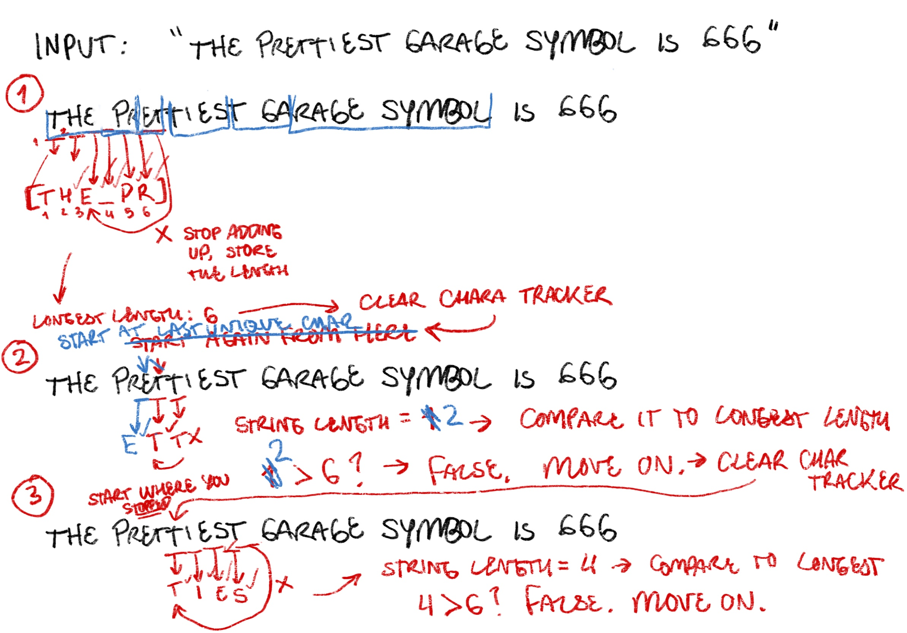

# [Longest Substring Without Repeating Characters (Leetcode)](https://leetcode.com/problems/longest-substring-without-repeating-characters/?envType=problem-list-v2&envId=rab78cw1)

## Problem

`Given a string s, find the length of the longest substring without duplicate characters.` \
In my own words: given a string, return an integer representing the \***\*number of characters\*\*** in the longest substring without repeating characters.

**In**: string \
**Out**: int

## Example

Running through it in procreate \
 \
 \


## Data Structures

1. Loop - to loop through the string
2. Obj - to keep track of the unique chars in the sub string
3. curr length variable - to track the length of the current sub string
4. longest length variable - to keep track of the longest length possible
5. length check - curr > longest ? boolean checker to see if we need to update longest

## Algorithm (Higher Level)

```js
//init longest variable
let longest = Number.MIN_VALUE //accuracy

for char of s { //loop thru
  let chartracker = new map() //init map

  if chartracker.has(char) { //checking if map has s
    if chartracker.length > longest {
      longest = chartracker.length
    }

    clear char tracker
    add s[char]
  }

  //if chartrack doesn't have char?
  add char

}
```

## Code

Using the set and pointer method

```js
var lengthOfLongestSubstring = function (s) {
  //using pointers and a set to keep track of the characters inside of the set/length
  let charSet = new Set();

  //initializing our maxlength variable
  let maxLength = 0;

  //initialize the pointers
  let l = (r = 0);

  //now we loop through the string. right pointer continuously goes forward, while l moves under the condition that there is a duplicate character
  for (r; r < s.length; r++) {
    while (charSet.has(s[r])) {
      charSet.delete(s[l]); //remove duplicate
      l++;
    }

    charSet.add(s[r]);

    maxLength = Math.max(maxLength, charSet.size);
  }

  return maxLength;
};
```

### Notes for After

Not gonna lie. I overcomplicated this one in my head. Was really confused about how to include the start and end points of the substring within my character counter, so I watched a video where someone solved this problem using pointers and a set. The pointers were really useful in the case where I had to include both the "start" and "end" of the substring inside of my character count, because I could add the pointers into the set.

Gave myself 15 minutes to learn about the algorithm then tried it out on my own. First of all, got stuck on the silliest thing– how to initialize two variables with the same value on the same line. Silly. I know!! Quickly figured that one out though. `let l = r = 0`

Was able to set up the for loop that allowed me to iterate through the string we were given. You only had to set the right pointer to move forward each time, while the left pointer moved upon the condition that \*the set still contained a duplicate character- meaning that the left pointer **had to move up until the duplicate character inside the substring was gone.\*** Even if the left pointer was pointing at say, character 'a' inside 'abca', if the right pointer found another 'b' up ahead, then the left pointer would move past 'a' _and_ 'b' inside of 'abca' to create 'ca' instead. That way, the right pointer pointing at the other 'b' could be added. Thus creating 'cab'.

I didn't fully understand this at the time, so inside my loop I had an "if" statement for when there was a duplicate character, not "while"- meaning the left pointer would move UNTIL THE DUPLICATE WAS GONE. The if statement would only execute once, so if the duplicate was in the middle of the set, I'd only be deleting a char before reaching the duplicate at all. Then moving on. That messed up my count.

Anyway in the end I decided to compare maxLength using the Math.max() method using the size of the character set itself because that was simpler than calculating the distance between the current pointers. Using the pointers are smart too, I'm just lazy.

Beginning to see the pattern with substrings and the sliding window method.
